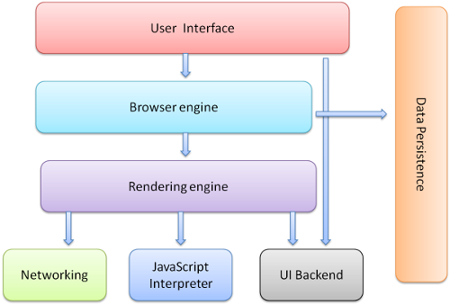
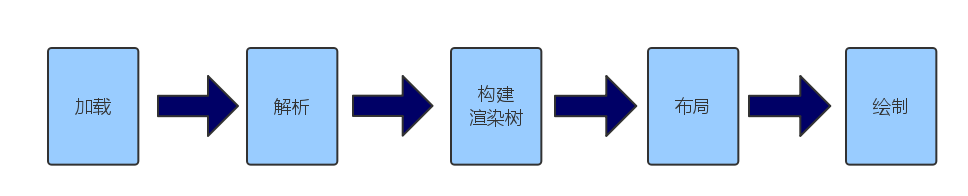
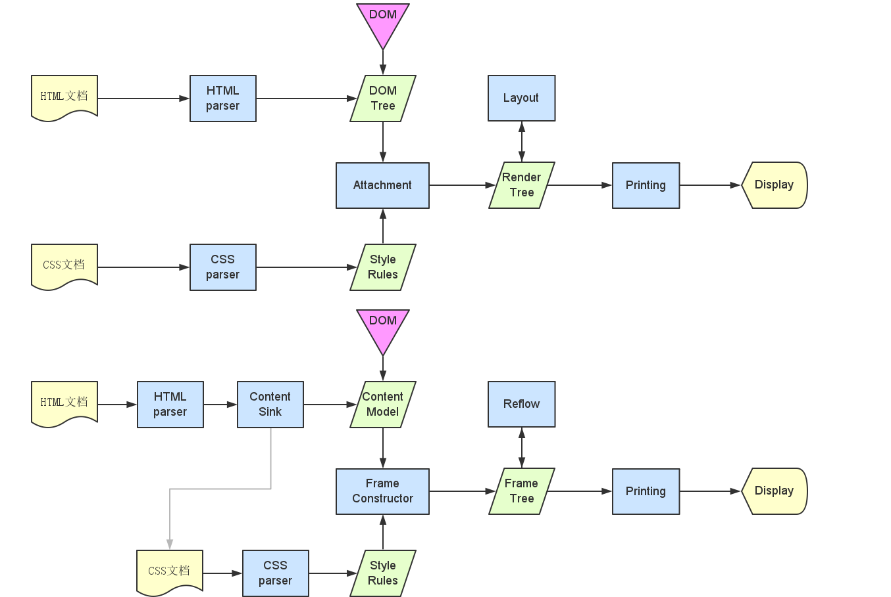
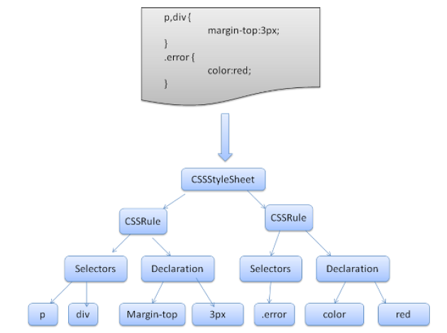
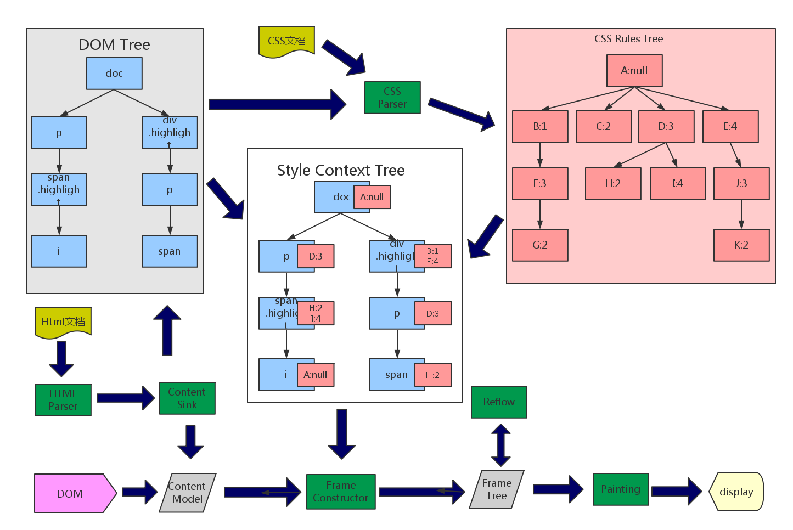

#浏览器的那些事儿#
##——加载、解析、渲染##
1. 了解了浏览器的加载过程，我们可以明确外部引入的资源（js，css...）应该放在Html文档的什么位置。
2. 了解了浏览器的解析过程，我们可以在编写Html和CSS文档时，知道如何优化浏览器的解析过程，以优化解析。
3. 了解了浏览器的渲染过程，我们在编写元素属性及js调用dom api时，如何有效的减少和避免reflow、repaint。

---

##浏览器的组件构成

1. 用户界面 － 包括地址栏、后退/前进按钮、书签目录等，也就是你所看到的除了用来显示你所请求页面的主窗口之外的其他部分。
2. 浏览器引擎 － 用来查询及操作渲染引擎的接口。
3. 渲染引擎 － 用来显示请求的内容，例如，如果请求内容为html，它负责解析html及css，并将解析后的结果显示出来。
4. 网络 － 用来完成网络调用，例如http请求，它具有平台无关的接口，可以在不同平台上工作。
5. UI后端 － 用来绘制类似组合选择框及对话框等基本组件，具有不特定于某个平台的通用接口，底层使用操作系统的用户接口。
6. JS解释器 － 用来解释执行JS代码。
7. 数据存储 － 属于持久层，浏览器需要在硬盘中保存类似cookie的各种数据，HTML5定义了web database技术，这是一种轻量级完整的客户端存储技术。

> 不同于大部分浏览器，Chrome为每个Tab分配了各自的渲染引擎实例，每个Tab就是一个独立的进程。

---

##流程

1. 加载：网页资源加载的过程。包括HTML文件及内嵌的各种资源文件，CSS JS image等。
2. 解析：HTML文档解析为DOM tree的过程。
3. 构建渲染树：通过DOM tree构建Render Tree的过程，计算ComputedStyle，去掉不显示或者display:none的元素。
4. 布局：计算所有Render Tree中的节点的位置及size。
5. 绘制：将所有Render Tree中的节点生成位图（textrue）并交由GPU显示输出

---

##加载##

浏览器获取各种资源文件的过程，各种浏览器及不同的版本的加载过程不尽相同。

1. 对于一个普通的Html文档，浏览器一般是边加载边解析渲染。
2. 加载过程中遇到外部文件，如CSS、IMG等，浏览器会另外发起一个请求来获取资源，这些都是异步请求，并不会影响到Html文档的加载。（当然这些并发请求对于同一域名的并发请求书也是有限制的，10 in IE 8, 6 in Firefox 3+ and Chrome 5+）
3. JS是个特殊的玩意儿，浏览器在Html加载过程中遇到JS，浏览器会挂起渲染的线程，不仅要等待JS文件加载完成，还要等待解析执行完成，才会恢复渲染过程。

###JS为什么要搞特殊###

JS有可能会修改DOM，比如说document.write。这就意味这JS在执行完成前，后续的所有资源的加载和解析渲染可能是没有必要的，这就是JS会挂起渲染线程的原因，而这个线程又是加载解析渲染同步的，所以一旦文档解析因为JS被挂起，后续的所有都会被挂起，直到JS解析执行完成。

---

###我们为什么要把CSS放在head标签里###

1. CSS文件并不会挂起渲染线程，我们假设在再Html加载解析完成的时候CSS文件没有下载完。我们就会先看到一个没有穿衣服的页面。直到CSS下载解析和DOM attachment然后再reflow、repaint，这个现象被称为FOUC（在CSS文件中使用@import会导致串行下载，同样会导致FOUC）。
2. 虽然CSS文件的加载并不影响JS文件的加载，但是会影响JS文件的执行。
> 原因：可能会有 var width = $('#id').width()，这意味着，js代码执行前，浏览器必须保证css文件已下载和解析完成。这也是css阻塞后续js的根本原因。
办法：当js文件不需要依赖css文件时，可以将js文件放在头部css的前面。

---

##解析、渲染##

解析和渲染我不知道如何分开，还是放到一起吧，各个浏览器的解析渲染过程会有细微的不同，但是总体来说分为如下步骤：

1. 解析Html文档生成DOM树。
2. 解析CSS文档与DOM树合成渲染树（frame tree、render tree）。
3. 布局（layout，reflow）
4. 绘制（paint）

---
##先看图

---

####区别####

流程上的区别：

1. 显而易见，整体上的执行流程，2者区别并不大，只是一些过程的名称不一样。如DOM tree和Content Model、Attachment和Frame Constructor、Render Tree和Frame Tree...其实在mozilla的官方wiki上也有DOM tree和Render tree的说法。
2. 在Gecko中多了一个Content Sink的过程，之后会说到。

流程上未提到的一些区别：

1. Gecko的style rules的数据结构于webkit不同，之后再Content Sink部分会说到。
2. webkit非常轻量，gecko很重，早期版本产生性能问题的XUL XPCOM组件为人诟病。

---

###Html解析###

	!html
	<html>
		<body>
			

				Hello World
			

			
 

		</body>
	</html>

---

####解析算法###

Html的解析算法（Html5为例）由2部分组成：分词、构建树

---

####分词####

---

Html的分词算法可以以状态机来描述，例如如下代码

	!html
	<html>
		<body>
			Hello world
		</body>
	</html>

1. 初始状态是”Data state”，当遇到”<“时状态改为“Tag open state”。吃掉”a-z”字符组成的符号后产生了”Start tag token”，状态变更为“Tag name state”。我们一直保持此状态，直到遇到”>”。每个字符都被追加到新的符号名上。在我们的例子中，解出的符号就是”html”。
2. 当碰到”>”时，当前符号完成，状态改回“Data state”。”<body>”标签将会以同样的方式处理。现在”html”与”body”标签都完成了，我们回到“Data state”状态。吃掉”H”（”Hello world”第一个字母）时会产生一个字符符号，直到碰到”</body>”的”<“符号，我们就完成了一个字符符号”Hello world”。
3. 现在我们回到“Tag open state”状态。吃掉下一个输入”/”时会产生一个”end tag token”并变更为“Tag name state”状态。同样，此状态保持到我们碰到”>”时。这时新标签符号完成，我们又回到“Data state”。同样”</html>”也会被这样处理。

---

####构建树####

构建树的算法也同样用状态机在描述：

1. 树的构建过程中，输入就是分词过程中得到的符号序列。第一个模式叫“initial mode”。接收 html 符号后会变成“before html”模式并重新处理此模式中的符号。这会创建一个HTMLHtmlElement元素并追加到根文档节点。
2. 然后状态改变为“before head”。我们收到”body”时，会隐式创建一个HTMLHeadElement，尽管我们没有这个标签，它也会被创建并添加到树中。
3. 现在我们进入“in head”模式，然后是“after head”，Body会被重新处理，创建HTMLBodyElement元素并插入，然后进入“in body”模式。
4. 字符符号”Hello world”收到后会创建一个”Text”节点，所有字符都被一一追加到上面。
5. 收到body结束标签后进入 “after body” 模式，收到html结束标签后进入“after after body”模式。所有符号处理完后将终止解析。
6. 解析结束后，浏览器会把文档标记为交互模式，并开始解析deferred模式的script。”deferred”意味着脚本应该在文档解析完成后执行。脚本处理完成后将进入”complete”状态，”load”事件发生。

---

####浏览器的宽容####

	!html
	<html>
  		<mytag>
  		</mytag>
  		

  		

  		

  			Really lousy HTML
  		

	</html>

1. 元素必需被插入在正确的位置。未关闭的标签应该一一关闭，直到可以添加新元素。
2. 不允许直接添加元素。用户可能会漏掉一些标签。
3. 在inline元素里添加block元素时，应关闭所有inline元素，再添加block元素。
4. 如果以上不起作用，关闭所有元素，直到可以添加，或者忽略此标签。

---

####CSS解析####

这是webkit的最终产生的数据结构，更类似于的一个set的数据结构，CSS parser的作用就是把CSS文档转化为一个这样的set数据结构。

每一个DOM tree中的节点都有一个attach方法，在Attachment过程中为每一个节点附加样式规则, 并计算样式，最终形成Render tree。
当然Attachment过程还会做一件事儿，去掉不显示的节点head、script等，还有display:none的节点。

---

####Content Sink####

在Gecko中有个再webkit流程中没有的过程----Content Sink，它的作用实在产生Content Model之前先产生一个数据结构用于搭建CSS Rules的数据结构。

	!html
    	<doc>
   			

   				这是个div啊
   				<i>我</i>是div里的highlight的span
  			

  			

  				我是div里的highlight的span
  				

  					我是p
  					我是span
  				

  			

		</doc>
	

---

####DOM树 和 CSS规则树####

> 图中我们可以看到，Gecko中的第三颗树 CSS Rule Tree，它的搭建依赖于由Content Sink输出的DOM树，形成可对照的树状数据结构---Style Context Tree。

---

##Reflow Repaint Recomposite##

1. Reflow（layout）：重新布局，width、height、margin、top、left...等属性改变触发。
2. Repaint：重新绘制，重新计算展现生成位图，color、border-style、background、visibility...等属性改变触发。
3. Recomposite：重组，重组位图，opacity、cursor、transform、z-index...等属性改变时触发。
4. 以上三个过程是顺序执行的3个过程，修改不同CSS属性会触发不同的过程。
5. 触发过程越前，渲染的代价越高。

---

##Reflow队列##

1. 我们已经知道元素的style属性改变如果影响元素几何属性，就会触发reflow。
2. 每次reflow都会产生较大的计算消耗，如果频繁的触发reflow会导致可观的性能问题。
3. 现代主流浏览器使用reflow队列的方式，来优化的这样的问题。浏览器会维护一个队列，在接受到style请求时放进这个队列，达到一定程度或者时限时批量顺序执行，使之只触发一次reflow。
4. 一些获取布局信息的操作会立刻触发reflow队列的reflow，浏览器需要立刻重排以返回正确的值。
    - offset(Top|Left|Width|Height)
    - scroll(Top|Left|Width|Height)
    - client(Top|Left|Width|Height)
    - getComputedStyle() (IE)

---

	!javascript

    el.style.width = '100px';
    el.style.height = '100px'; // reflow

    el2.style.width = el.offsetWidth * 1.5 + 'px'; // reflow
    el3.style.width = el.offsetWidth * 2 + 'px'; // reflow

    var width;
    el.style.cssText = "width: 100px; height: 100px;"; // reflow
    // or el.className = "square";
    width = el.offsetWidth;
    el2.style.width = width * 1.5;
    el3.style.width = width * 2; // reflow

---

##GPU硬件加速
1. texture: 可以看作一个放在GPU上的位图。
2. GPU擅长对texture进行偏移，缩放，渲染，改变透明度等计算。
3. 浏览器会根据CSS属性为元素生成Layers。
4. 将Layers作为texture上传到CPU。
5. 当改变Layer的transform，opacity属性时，渲染会跳过Reflow、Repaint，直接通知GPU对Layer做变换（Recomposite）。
6. 当启动GPU硬件加速，省去了CPU进行Reflow、Repaint的过程，也省去了CPU向GPU传输位图的过程。

---

##如何触发硬件加速
1. 3d的perspective transform属性。
2. 使用animation或者transition改变了opacity，transform的元素。
3. video
4. canvas
5. flash
6. CSS filters
7. 包含在其他layer上的元素

---

###题外话，浏览器中的5个常驻线程###

1. 浏览器GUI渲染线程
2. javascript引擎线程
3. 浏览器定时器触发线程（setTimeout）
4. 浏览器事件触发线程
5. 浏览器http异步请求线程（.jpg <link />这类请求）

###霸道的javascript引擎线程###

当js引擎线程进行时，会挂起其他一切线程，这个时候3、4、5这三类线线程也会产生不同的异步事件，由于 javascript引擎线程为单线程，所以代码都是先压到队列，采用先进先出的方式运行，事件处理函数，timer函数也会压在队列中，不断的从队头取出事件，这就叫：javascript-event-loop。

